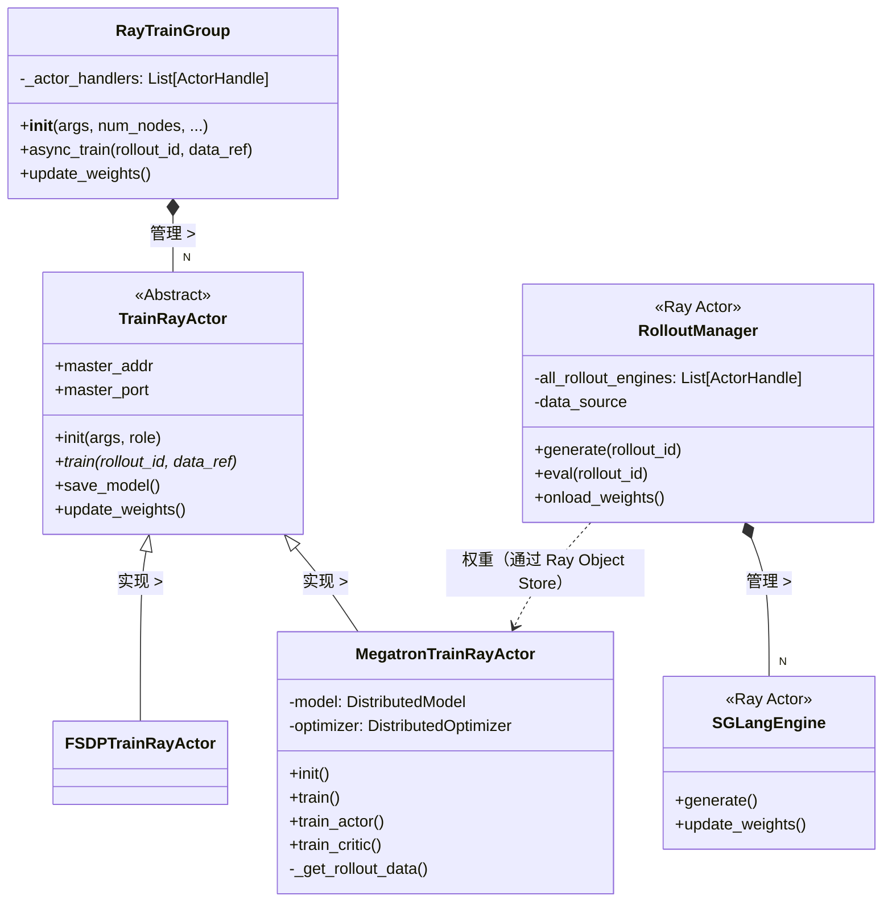

# Slime 类设计与架构深度剖析

> "空谈无益，show me the code。" — Linus Torvalds

本文档对类层次结构、各组件的角色与职责，以及设计背后的逻辑进行底层解析，是对高层概览文档 `architecture_summary.md` 的补充。

## 1. 类层次结构与关键关系

系统在 Ray Actor 基础设施与具体训练后端（Megatron/FSDP）之间采用了**桥接模式（Bridge Pattern）**。



## 2. 角色与职责

| 类 | 角色 | 核心职责 | 设计原因 |
| :--- | :--- | :--- | :--- |
| **`RayTrainGroup`** | **编排器代理（Orchestrator Proxy）** | 抽象管理 N 个分布式 Worker 的复杂性。当 `train.py` 调用 `model.async_train()` 时，该类将调用广播至所有 4/8/16 个 Worker Actor。 | 保持 `train.py` 简洁。高层逻辑无需感知底层有多少块 GPU。 |
| **`TrainRayActor`** | **抽象 Worker（Abstract Worker）** | 定义训练节点的接口契约（Interface Contract）："初始化"、"训练"、"保存"、"休眠"。处理分布式组的基础网络配置（`MASTER_ADDR`）。 | 强制执行接口契约，允许在不修改编排器的情况下切换后端（Megatron vs FSDP）。 |
| **`MegatronTrainRayActor`** | **具体 Worker（Concrete Worker）** | 封装复杂的 NVIDIA Megatron-LM 逻辑，包括：初始化（`dist.init_process_group`）、数据获取（`_get_rollout_data` 将张量移至 GPU）以及 `forward/backward` 循环。 | **封装性（Encapsulation）**。Megatron 内部混乱（全局状态、猴子补丁），该类将这些复杂性封装在内，防止其泄漏到外部。 |
| **`RolloutManager`** | **推理控制器（Inference Controller）** | 生成流程的"大脑"。决定*生成什么*、*何时注入故障*，以及*如何*将输出的 `Sample` 对象转换为训练张量。 | **隔离性（Isolation）**。推理所需的依赖（SGLang/vLLM）和硬件使用模式与训练截然不同。 |
| **`SGLangEngine`** | **推理引擎（Inference Engine）** | SGLang 服务器的封装层，执行实际的 LLM 生成任务。 | 性能。SGLang 针对吞吐量（Throughput）做了深度优化。 |

## 3. 交互流程：一个"训练步骤"

下图详细描述了 `train.py` 执行单次循环时的完整流程。

```mermaid
sequenceDiagram
    participant Main as train.py
    participant RM as RolloutManager
    participant Actor as RayTrainGroup (Actor)
    participant Worker as MegatronTrainRayActor
    
    Note over Main: 循环开始
    
    Main->>RM: generate.remote(rollout_id)
    activate RM
    RM->>RM: 调用 SGLang Engine
    RM->>RM: 转换 Sample -> RolloutBatch
    RM-->>Main: 返回 data_ref (ObjectRef)
    deactivate RM
    
    Main->>Actor: async_train(rollout_id, data_ref)
    activate Actor
    Actor->>Worker: train.remote(rollout_id, data_ref)
    deactivate Actor
    
    activate Worker
    Note right of Worker: 1. ray.get(data_ref) <br/> 2. 移至 GPU <br/> 3. Forward/Backward <br/> 4. 优化器步进
    Worker-->>Main: 返回（异步 Future）
    deactivate Worker

    Main->>Main: 等待训练完成 (ray.get)
    
    Main->>Actor: update_weights()
    Actor->>Worker: update_weights.remote()
    Worker->>Worker: 同步本地权重至 CPU
    
    Main->>RM: onload_weights.remote()
    RM->>Worker: 拉取权重（通过 Ray Object Store 隐式完成）
    RM->>RM: 更新 SGLang Engine
```

## 4. 设计哲学与 Linus 点评

### 好品味：代理模式（Proxy Pattern）
`RayTrainGroup` 是"好品味"的典型示例。
- **问题**：你有 16 个 Actor，但不希望主循环中每次调用都写一堆列表推导式。
- **解决方案**：`RayTrainGroup` 对外表现为单一对象，调用 `group.train()` 后它自行处理广播（Broadcast）逻辑。
- **效果**：`train.py` 读起来像伪代码，所有分布式复杂性被隐藏在幕后。

### "务实"的妥协：`RolloutManager`
如架构概览中所述，`RolloutManager` 是一个上帝对象（God Object）。
- **原因**：这很可能是"实用主义（Pragmatism）"的产物——开发者需要一个地方来放置"训练前发生的所有事情"。
- **风险**：它将*控制逻辑（Control Logic）*（容错、调度）与*数据逻辑（Data Logic）*（Sample 转换、Tokenization）混合在一起。
- **重构方向**：若追求严格的 Linux 内核风格，应将 `DataProcessor`（纯函数（Pure Function））与 `RolloutScheduler`（状态机（State Machine））拆分开。但对于 Python ML 项目而言，这种集中化（Centralization）设计简化了共享状态（如 `data_source`）的管理。

### 内存管理（Memory Management）："Offload"
代码中对 `offload_train` 和 `offload_rollout` 有大量处理。
- **设计**：Actor 中有显式的 `sleep()` 和 `wake_up()` 方法。
- **本质**：这说明系统始终在 GPU 显存容量的边缘运行。它实质上为模型实现了一套"虚拟内存（Virtual Memory）"机制——将暂不使用的模型换出（Swap Out）至 CPU 内存（通过 Ray Object Store 或宿主机内存）。
- **复杂性**：这引入了可观的状态管理（State Management）复杂度（`reload_process_groups`、`destroy_process_groups`）——这是针对大模型不得不为之的脆弱但必要的优化。

## 5. 关键实现细节（Megatron 专项）

`MegatronTrainRayActor` 揭示了让分布式训练正常运行所需的"黑魔法（Dark Arts）"：
- **猴子补丁（Monkey Patching）**：`init` 阶段调用了 `monkey_patch_torch_dist()`，这直接承认了底层库并不完美。
- **张量备份器（Tensor Backuper）**：`weights_backuper` 机制允许同时维护权重的"黄金副本（Gold Copy）"（Actor 当前权重）和"旧副本（Reference Copy）"（参考权重），并通过指针切换（Pointer Swap）在两者之间来回，而非频繁进行深拷贝（Deep Copy）。这是一个关键的性能优化。
